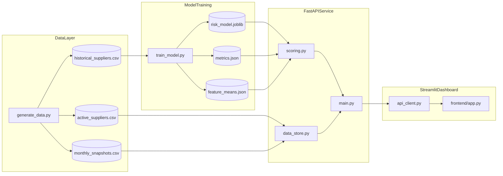
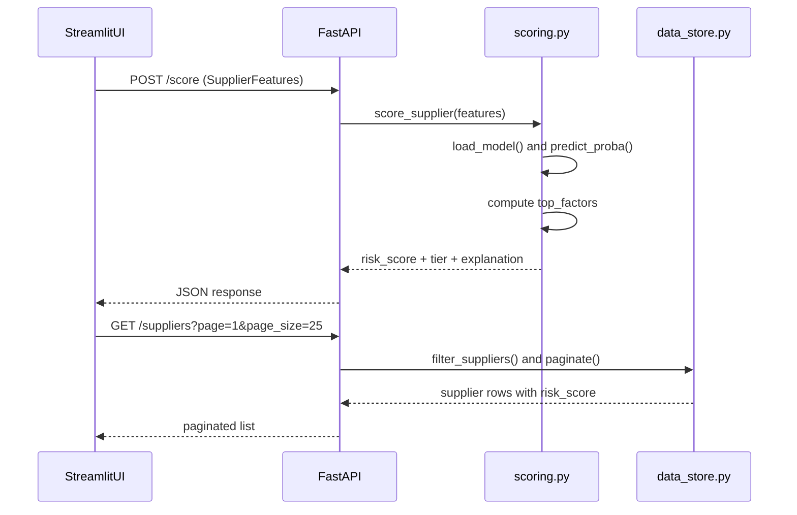
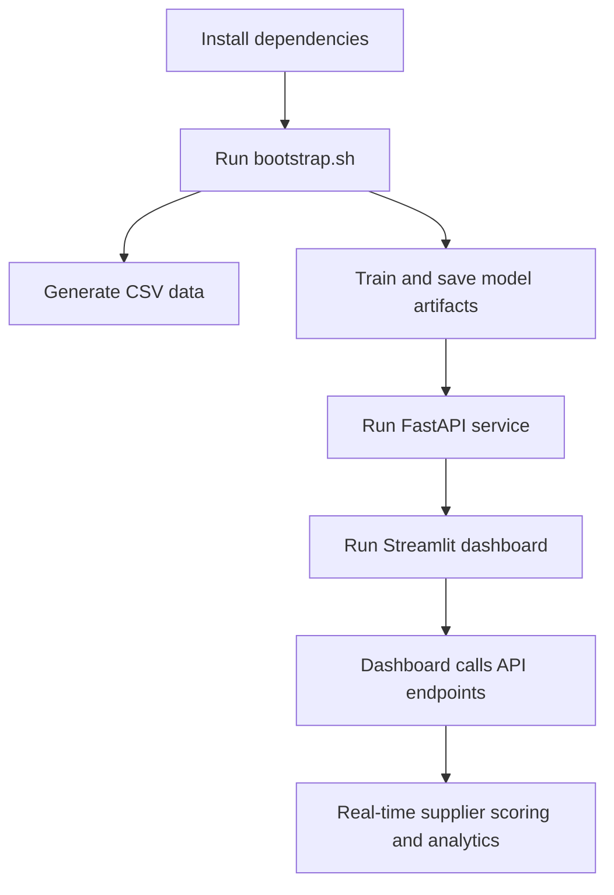

# Supplier Risk Intelligence - Deep Documentation

## 1) What problem this project solves

Procurement and supply-chain teams often rely on manual checks (spreadsheets, periodic audits, subjective vendor ratings) to estimate supplier risk. That process usually fails in three ways:

- Signals are fragmented across operational, financial, and quality sources.
- Risk decisions are lagging, because reviews happen monthly or quarterly.
- It is hard to explain *why* a supplier is flagged.

This project productizes supplier-risk logic into a practical system that:

- Scores suppliers consistently using machine learning.
- Exposes scoring through an API for operational workflows.
- Gives a dashboard for portfolio-level monitoring and supplier drill-down.
- Provides basic explainability (top contributing factors) for each prediction.

---

## 2) High-level architecture



Core split:

- **Data generation** (`backend/data/generate_data.py`)
- **Model training** (`backend/ml/train_model.py`)
- **Serving and scoring** (`backend/app/main.py`, `backend/app/scoring.py`, `backend/app/data_store.py`)
- **Visualization layer** (`frontend/app.py` + page modules)

---

## 3) Data model and synthetic feature design

The project uses a supplier feature set that combines identity + operational + financial + engagement signals.

### Identity

- `supplier_id`, `name`, `category`, `country`, `onboarded_date`, `tier`, `years_in_business`

### Operational

- `on_time_delivery_rate`
- `avg_delivery_delay_days`
- `defect_rate`
- `order_volume_monthly`
- `fulfillment_rate`
- `return_rate`

### Financial

- `payment_delay_days`
- `credit_score`
- `debt_to_equity`
- `current_ratio`
- `revenue_growth_pct`
- `cash_runway_months`

### Engagement / quality

- `complaints_last_90d`
- `contract_renewal_rate`
- `quality_audit_score`

The synthetic generator uses latent health factors + distributions + noise to create realistic correlations (for example: lower quality and lower delivery performance tend to align with higher complaints and higher distress probability).

---

## 4) Labeling logic (distress target)

Historical rows get a binary `defaulted` label from a probabilistic scoring equation. The label is not deterministic; it samples from a sigmoid probability, which avoids trivial separability.

Risk-increasing signals include:

- Higher `defect_rate`
- Higher `payment_delay_days`
- More `complaints_last_90d`
- Higher `debt_to_equity`
- Lower `on_time_delivery_rate`
- Lower `fulfillment_rate`
- Lower `credit_score`
- Lower `cash_runway_months`

This keeps the model training meaningful while still being demo-safe.

---

## 5) Model training design

Training script: `backend/ml/train_model.py`

Pipeline:

1. Load `historical_suppliers.csv`
2. Select canonical feature columns
3. Stratified 80/20 train-test split
4. Train `Pipeline(StandardScaler -> RandomForestClassifier)`
5. Compute metrics and feature importances
6. Save artifacts:
   - `backend/ml/risk_model.joblib`
   - `backend/ml/metrics.json`
   - `backend/ml/feature_means.json`

### Why this model?

- Random forest handles mixed-scale nonlinear interactions well.
- Good baseline performance with low tuning effort.
- Feature importances are easy to expose in UI/API.

### Risk score mapping

- `risk_score = predict_proba(class=distress) * 100`
- Tier mapping:
  - `< 25`: Low
  - `25-50`: Moderate
  - `50-75`: High
  - `>= 75`: Critical

---

## 6) Backend API behavior

Main service file: `backend/app/main.py`

### Endpoint summary

- `GET /health`: model and service readiness
- `GET /metrics`: model performance and importances
- `GET /categories`, `GET /countries`: filter metadata
- `POST /score`: single supplier scoring
- `POST /score/batch`: batch scoring
- `GET /suppliers`: paginated/filterable scored supplier list
- `GET /suppliers/{supplier_id}`: detailed row + explanation
- `GET /snapshots`: trend data for analytics charts

### Request/response flow



---

## 7) Explainability approach

File: `backend/app/scoring.py`

Current explanation is a fast heuristic:

`contribution ~= feature_importance * signed_z_score_from_mean`

Where direction is adjusted by feature semantics:

- For "higher is worse" features, positive z-score increases risk.
- For "lower is worse" features, negative z-score increases risk.

This gives immediate and lightweight factor insights suitable for UI cards/tags.

---

## 8) Frontend design (Streamlit + Ant-style UX)

Entry point: `frontend/app.py`

Pages:

- `frontend/pages_/overview.py`
- `frontend/pages_/suppliers.py`
- `frontend/pages_/analytics.py`
- `frontend/pages_/score_form.py`
- `frontend/pages_/model_insights.py`

Theme:

- `frontend/theme.py`
- `frontend/assets/style.css`

The UI uses `streamlit-antd-components` (`sac.menu`, `sac.pagination`, `sac.alert`, `sac.segmented`, `sac.result`) and Plotly for visual analytics.

---

## 9) Dashboard page-by-page behavior

### Overview

- Portfolio KPIs (total suppliers, avg risk, fulfillment, etc.)
- Tier donut + score histogram
- Fulfillment vs target by category
- Monthly trend from snapshots
- Top risk-flagged supplier table

### Suppliers

- Filters (category, country, risk tier, score range, search)
- Paginated table
- Supplier detail drill-down with:
  - top factor bar chart
  - radar profile
  - full metric pill grid

### Analytics

- Risk by category and country
- Defect vs on-time scatter
- Time series trends
- Correlation heatmap
- Tier-level distribution diagnostics

### Score a Supplier

- What-if form for all input features
- Preset profiles for quick demos
- Live call to `POST /score`
- Result card + gauge + top contributors

### Model Insights

- ROC AUC / precision / recall / confusion matrix
- Feature importance ranking
- Score percentile overview

---

## 10) End-to-end runtime flow



Commands:

```bash
pip install -r requirements.txt
./scripts/bootstrap.sh
./scripts/run_backend.sh
./scripts/run_frontend.sh
```

---

## 11) How to generate more test data

The generator now supports CLI arguments.

### Larger demo dataset

```bash
python backend/data/generate_data.py --historical 50000 --active 5000 --months 36 --seed 42
python backend/ml/train_model.py
```

### Very large load-testing dataset

```bash
python backend/data/generate_data.py --historical 200000 --active 20000 --months 60 --seed 99
python backend/ml/train_model.py
```

Notes:

- Retrain the model after regeneration so API and dashboard remain consistent.
- `GET /suppliers` enforces `page_size <= 500`; for large demos, query page-by-page.
- Keep snapshots months aligned to your chart needs (24-60 is a practical range).

---

## 12) Can we use real data in this app?

Yes, but do it through a governed pipeline.

### Recommended real-data onboarding strategy

1. **Define a canonical schema** matching the existing feature columns.
2. **Create an ingestion mapper** from ERP/PLM/quality systems to canonical columns.
3. **Add validation rules** (ranges, null checks, outlier caps).
4. **Pseudonymize sensitive IDs** before landing to analytics datasets.
5. **Version datasets** (for reproducibility and rollback).
6. **Retrain and evaluate** with the same metric set.
7. **A/B compare synthetic vs real-data model** before production cutover.

### Suggested folder extension

```text
backend/data/
  raw/
  staging/
  curated/
  generate_data.py
  ingest_real_data.py
```

### Candidate real-data sources

- Internal: ERP purchase orders, delivery SLAs, quality inspections, AP aging, supplier audits
- Public/commercial (depending on licensing): D&B / Creditsafe risk data, open trade datasets, customs shipment summaries, company financial filings

### Compliance and legal checks

Before using real supplier data:

- Confirm contractual rights for model training and UI display.
- Apply data minimization and retention policies.
- Mask or hash personally identifiable or commercially sensitive fields.
- Maintain access controls and audit logs for data exports.

---

## 13) Recommended next technical upgrades

- Add `/version` endpoint exposing model hash + data snapshot ID.
- Add SHAP-based explanations (optional heavy dependency).
- Add automated drift checks between training and live data distributions.
- Add pytest suite for API contract and scoring invariants.
- Add Docker + compose for one-command environment startup.

---

## 14) Quick troubleshooting guide

- **`/metrics` returns 503**: model artifacts missing. Run `python backend/ml/train_model.py`.
- **Dashboard cannot connect**: verify `RISK_API_URL` and backend process.
- **Charts look empty**: verify `active_suppliers.csv` and `monthly_snapshots.csv` were generated.
- **Unexpected scores**: retrain after any schema or generation changes.

---

## 15) File map for maintainers

- Data generation: `backend/data/generate_data.py`
- Training: `backend/ml/train_model.py`
- API app: `backend/app/main.py`
- Scoring logic: `backend/app/scoring.py`
- Data filtering/pagination: `backend/app/data_store.py`
- API schema contracts: `backend/app/schemas.py`
- Frontend shell: `frontend/app.py`
- Frontend pages: `frontend/pages_/`
- Frontend theme: `frontend/theme.py`, `frontend/assets/style.css`

